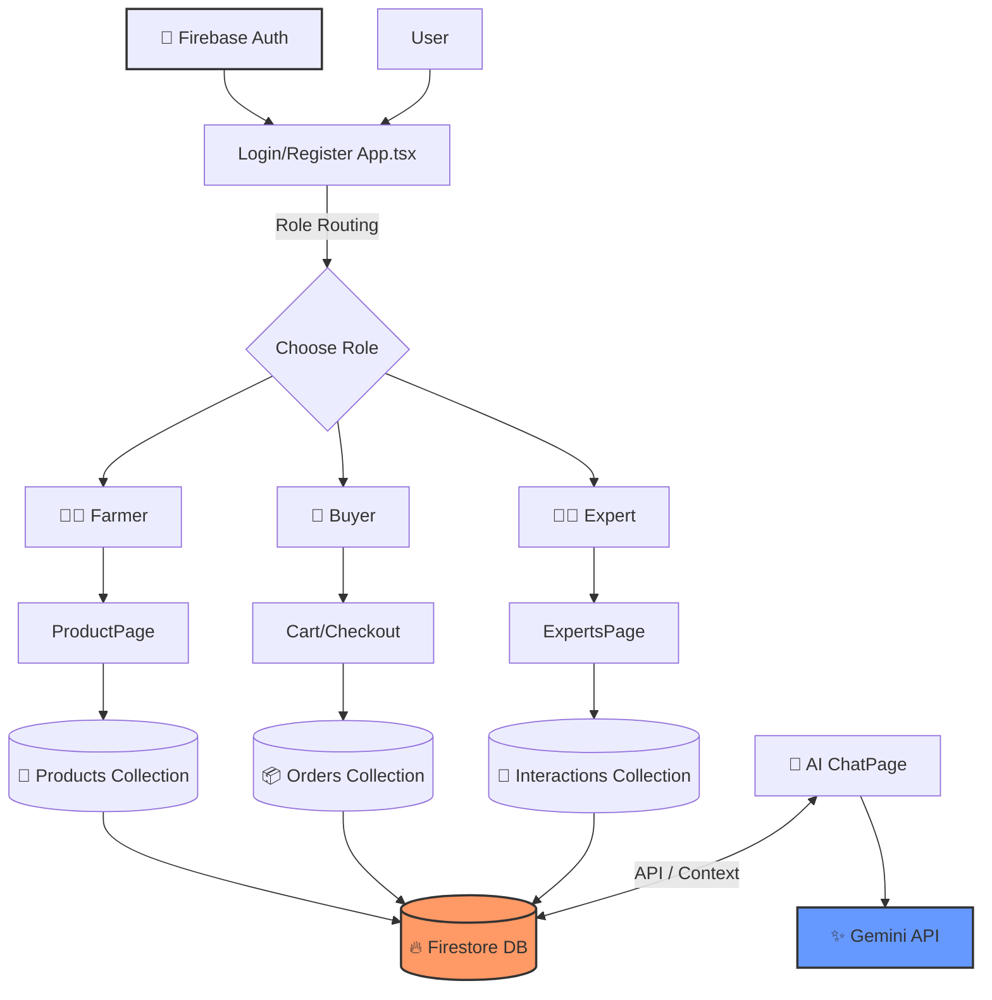

# 🌾 Krishify (https://krishify-seven.vercel.app/) 

An integrated digital agricultural platform developed to promote sustainable rural development and economically provide farmers in Maharashtra with two things . Using three pieces of technology – artificial intelligence (AI), professional agronomic assistance and a direct-to-consumer marketplace through decentralized operations – Krishify will solve some of the most pressing issues facing Indian farmers, such as unpredictability of crop disease and crop pricing controlled by the almighty middleman . 
--- 
## 🚀 Featured Module 

Krishify integrates numerous technology-enabled modules into an accessible, user-friendly interface through a unique web dashboard : 

*   **🧠 AI Disease Detection from a Photograph** – Allows a farmer to upload an image of their crop and have it analyzed by looking for symptoms of disease, posting an instant diagnosis of the problem, listing causes and prevention measures, and providing recommendations for treatment . 
*   **🛒 Direct Peer-to-Peer Marketplace** – Decentralized e-commerce site allowing farmers to list products, describe them, and post fair prices while trading, both retail and wholesale, directly with buyers . 
*   **📊 Market Price Analysis** – Provides real-time, location-specific pricing information on agricultural products from multiple locations and seasons for better price comparisons and increased crop profitability . 
*   **🧑‍🌾 Expert Consultation System** – A direct line for establishing communication between farmers in rural communities and professional agronomists for planting, watering, fertilizing, and pest control advice . 
*   **🏛️ Government Schemes Folder:** This folder contains a list of the available subsidies, insurance, and financial assistance programs that you may qualify for. It will provide information on how to qualify and apply for the programs.
*   **🤖 AI Chatbot Helper:** This chatbot acts as a 24/7 virtual agricultural assistant to provide immediate solutions to your most common crop management/ fertilizing questions.

---

## 🛠️ Technical System

The platform has been developed using a multi-level architectural approach for scalability. There are three layers: presentation, application, and database layer. 

*   **Front-End Web Dashboard:** React.js - We created a mobile-friendly, simple-to-use front-end web dashboard for rural users to access their accounts; however, it also provides very sophisticated management capabilities for ag-experts, buyers, and platform administrators.
*   **Back-End Server:** Java Server Frameworks - A back-end server that coordinates the fundamental logic of the platform, user identity verification, RESTful Web Services, and module-to-module communication. 
*   **Database Engine:**  Firebase Database - The database engine stores structured data tables for user profiles, crop activity, crop sales, transactional ledgers, and observational records of crop diseases.

## 🏗️ Core Architecture Flow

**📊 System's Methodology & Implementation**:

1.	**User Verification & Authentication**: Farmers will have the ability to create an account on the platform through a web-based registration and validation process. 

2.	**Markets Ledger Operations**: All new listings on markets will be instantly available for consumers to find at the same time, and they will be able to make contact directly with the farmers that created each listing without going through an intermediary

3.	**Diagnostic Pipeline**: Images of leaves taken by farmers on the platform can be sent directly to the server using a RESTful service for the purpose of allowing computers to make inferences about the condition of those leaves using computer vision technology .

**🔮 Future Scope**:

Future iterations of Krishify's digital agriculture platform will continue to modernize the user experience by adding :

*	Internet of Things (IoT) sensors mounted on farms to provide real-time information about soil and ambient environmental conditions .
*	Predictive analytics engines to assist farmers in making more informed decisions about when to plant and help them prepare for seasonal weather variations .
*	Using blockchain technology for transactions and to track products in the supply chain from farm gate to retail store .
*	A multilingual voice assistant tool to help overcome literacy issues and make it easier for farmers to interact with the platform .

## 💻 Research and Writing

This project is built directly off the published research paper titled:  
**AI-Driven Precision Agriculture and Decentralized Marketplaces in Maharashtra** 

### Authors:
*   **Mr. Shreyash Udayrao Mane** (Department of Computer Engineering, D. Y. Patil School of Engineering and Management, Kolhapur)
*   **Mr. Ashitosh Krishna Ingale** (Department of Computer Engineering, D. Y. Patil School of Engineering and Management, Kolhapur)
*   **Prof. Satish Ranbhise** (Department of Computer Engineering, D. Y. Patil School of Engineering and Management, Kolhapur)
*   **Prof. Juber M. Mulla** (Department of Electronics and Telecommunication Engineering, D. Y. Patil School of Engineering and Management, Kolhapur)

### Contributors
Mr. Shreyash Udayrao Mane, Computer Engineering Department, D. Y. Patil School of Engineering & Management, Kolhapur 
---

## 📄 License

This repo is licensed under the MIT License
